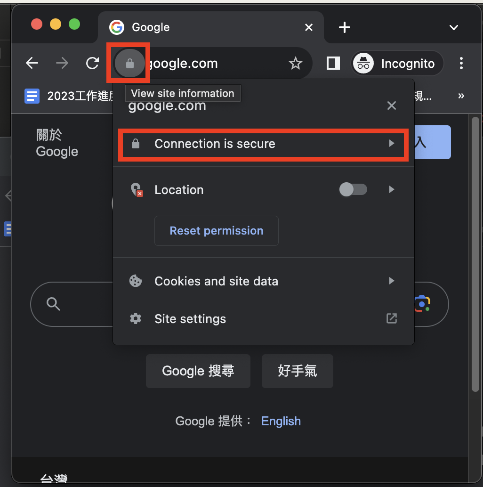

# SSLPinningWebView

This is a simple demo for SSL pinning checks.

We use `google.com` and `medium.com` as test websites. Before running the code, you should export the certificates of `google.com` and `medium.com` from your preferred browser. Then import these certificates into the project.

Note that you must export the certificates using `DER encoding`. Otherwise, the verification of the certificates will fail.

**Step 1** 

**Step 2**  

**Step 3**  

**Step 4**  

Test cases
---------
1. testURLSessionTask 
   - sends a URLRequest to the target URL
2. showWebPage 
   - simply loads a web page.
